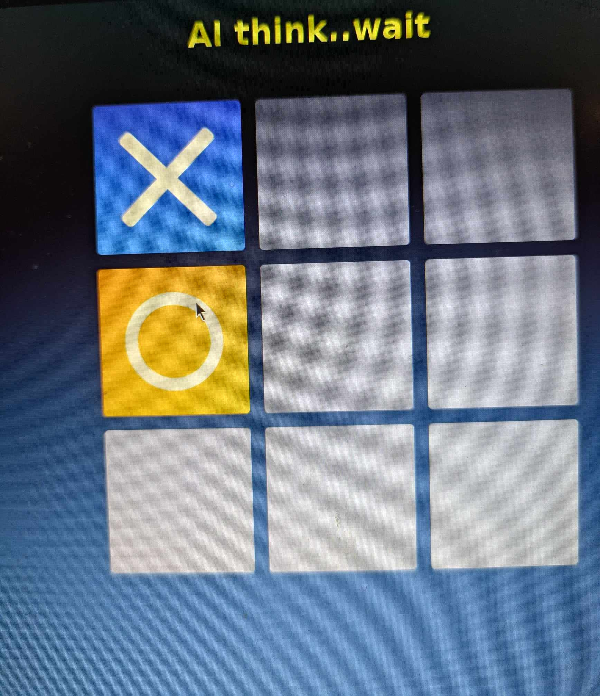

# Tic Tac Toe The Ultimate Collection.

# Cover any TTT from singel player to AI ✅  

## Zoom out to fit any sceen ✅

## Choose who to start first ✅

**AI need 1 second to 'think'..☝️**

**Start page for any game**
 https://kaliscandinavia.github.io/Tictactoe

  **OS compatibility.Tested on** ✅
    
  ..
  .
  
  

**
AI  Waiting For You !
**

**Code language used;**

  

(<a href="#up"</a>Up to top
  

(<a href="https://github.com/kaliscandinavia/ ">To Kali Scandinavia</a>)

